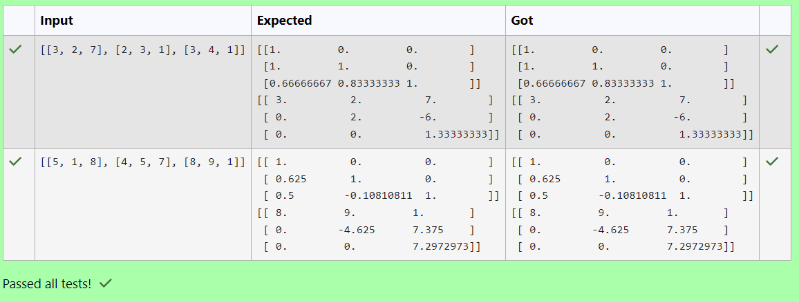

# LU Decomposition 

## AIM:
To write a program to find the LU Decomposition of a matrix.

## Equipments Required:
1. Hardware – PCs
2. Anaconda – Python 3.7 Installation / Moodle-Code Runner

## Algorithm
1. Import lu(),lu_factor() and lu_solve() from scipy.linalg library
2. Use lu() method to find lower and upper matrix.
3. Use lu_factor() and lu_solve to solve the two matrixes.
4. End the program.

## Program:
(i) To find the L and U matrix
```
Program to find the L and U matrix.
Developed by: Karan A
RegisterNumber: 212223230099
```
```
import numpy as np
from scipy.linalg import lu
matrix=np.array(eval(input()))
pivot,lower_matrix,upper_matrix=lu(matrix)
print(lower_matrix)
print(upper_matrix)
```
(ii) To find the LU Decomposition of a matrix
```
Program to find the LU Decomposition of a matrix.
Developed by: Karan A
RegisterNumber: 212223230099
```
```
import numpy as np
from scipy.linalg import lu_factor,lu_solve
A=np.array(eval(input()))
B=np.array(eval(input()))
lu,piv=lu_factor(A)
X=lu_solve((lu,piv),B)
print(X)
```
## Output:
### (i) L and U

### (ii) LU decomposition


## Result:
Thus the program to find the LU Decomposition of a matrix is written and verified using python programming.

